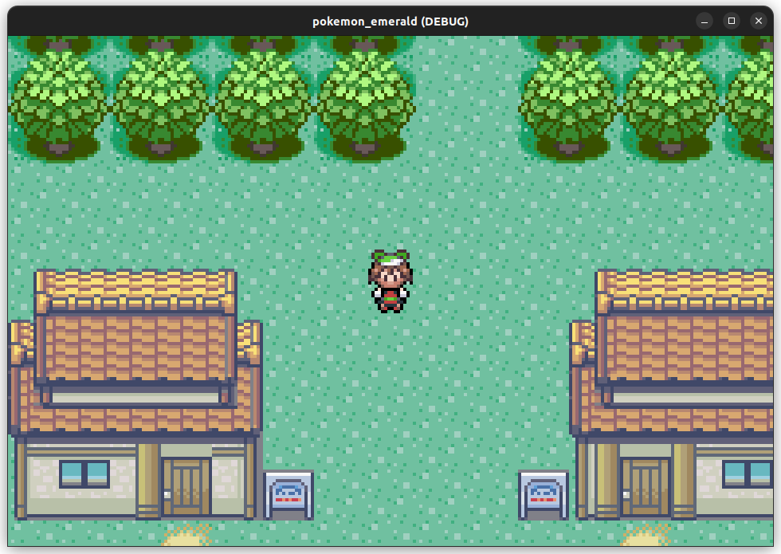

### Clone of Pokemon Emerald in the Godot Gameengine

## NOTE (ONGOING)
# Project is currently being developed.
# Probably will be finished around new years, but no promises.

## RESOURCES
- Sprites are ripped from spritersresource.com/game-boy-advance/pokemon-emerald
- Music is ripped from downloads.khinsider.com/game-soundtracks/album/pokemon-emerald-enhanced-soundtrack/

# There is a corespoding youtube video by me, which you can watch.
- youtube: https://www.youtube.com/watch?v=9SDiq2hfyXs

# Implementation Check List:
- Player movement
- Room transition
- Wild Pokémon battles 

# To be implemented:
- 50% of the overworld and most of the subrooms
- Trainer battles (Trainer AI)
- Different Leveling Groups for the Leveling System
- Animated Doors
- Story Progress
- Moving NPC's
- Performance Optimizations
- Refactoring of the entire codebase. 

